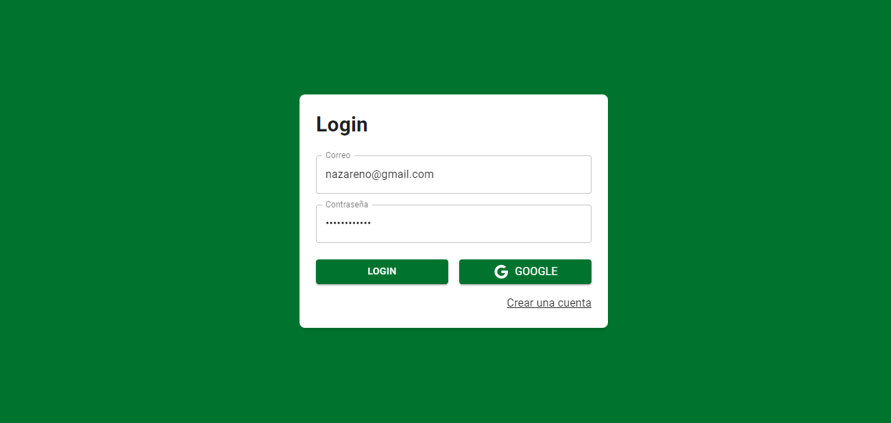
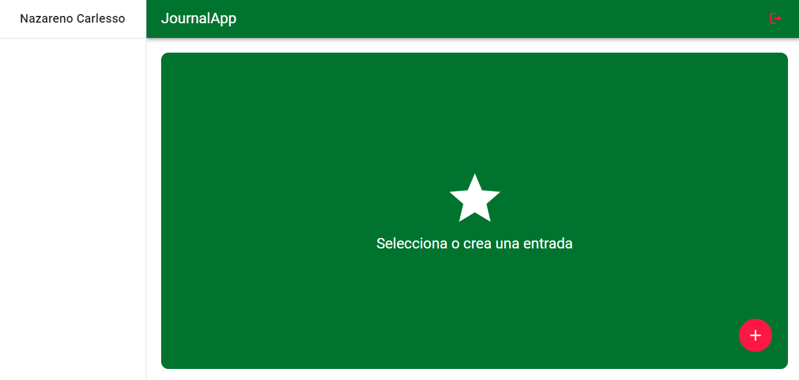
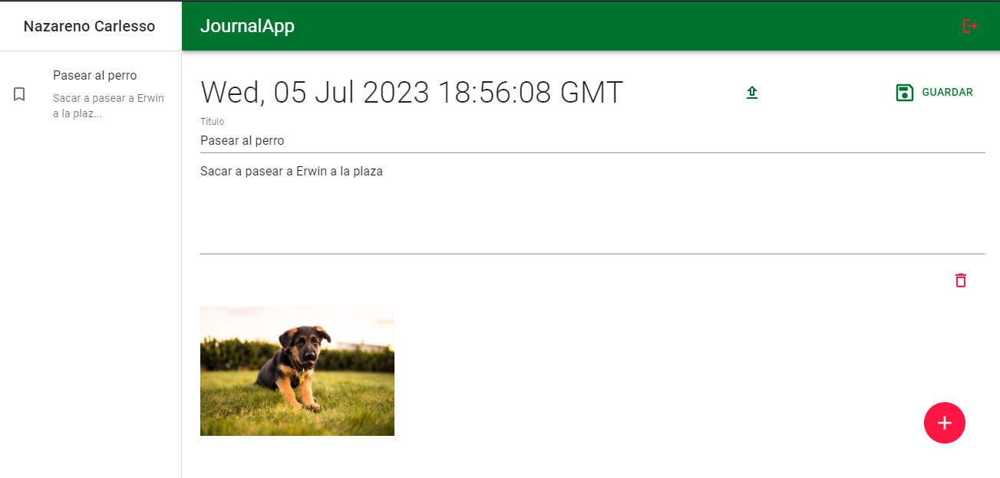

# Journal App

[](https://app.netlify.com/sites/nazarenocarlesso-journal-app/deploys)

### Journal where you can save notes and images to be stored in firebase

## Setup

Debe contener un archivo de configuracion ```.env``` en la raiz del directorio
con las siguientes variables

```VITE_API_KEY, VITE_AUTH_DOMAIN, VITE_PROJECT_ID,```
```VITE_STORAGE_BUCKET, VITE_MESSAGING_SENDER_ID, VITE_APP_ID```

Extraidas desde la consola de firebase

## Screenshots




